# 🔄 Integración Completa con Flow.cl

## 📋 Resumen del Sistema

Sistema de pagos anuales para acceso a reportes individuales de corredores de seguros, integrado con la plataforma de pagos Flow.cl.

## 🏗️ Arquitectura del Sistema

### 1. **Flujo de Compra**

```mermaid
sequenceDiagram
    participant U as Usuario
    participant F as Frontend
    participant API as API Next.js
    participant Flow as Flow.cl
    participant DB as Supabase
    
    U->>F: Selecciona producto
    F->>API: POST /api/reportes/comprar
    API->>DB: Crear registro pago
    API->>Flow: Crear orden de pago
    Flow-->>API: Token de pago
    API->>DB: Actualizar pago con token
    API-->>F: URL de pago Flow
    F->>Flow: Redirigir a pago
    Flow->>U: Procesar pago
    Flow->>API: Webhook confirmación
    API->>DB: Actualizar estado pago
    API->>DB: Crear acceso usuario
    API->>DB: Generar reporte
```


### 2. **Estructura de Base de Datos**

#### Tablas Principales:
- `corredores` - Información de corredores
- `productos` - Catálogo de productos (reportes)
- `pagos` - Transacciones y pagos
- `accesos_usuarios` - Permisos de acceso
- `reportes_individuales` - Reportes generados
- `transacciones_flow` - Auditoría Flow.cl
- `configuracion_flow` - Configuración API Flow

## 🔧 Configuración Inicial

### 1. **Variables de Entorno**
```bash
# Flow.cl Configuration
FLOW_API_KEY=tu_api_key_flow
FLOW_SECRET_KEY=tu_secret_key_flow
FLOW_API_URL=https://www.flow.cl/api
FLOW_SANDBOX_MODE=true

# URLs de retorno
FLOW_URL_RETURN=http://localhost:3000/pago/exito
FLOW_URL_CONFIRMATION=http://localhost:3000/api/flow/webhook
```

### 2. **Ejecutar Esquema de Base de Datos**
```sql
-- Ejecutar en Supabase SQL Editor
-- Archivo: esquema-completo-bd.sql
```

## 💳 Integración con Flow.cl

### 1. **Crear Orden de Pago**

```javascript
// /api/reportes/comprar/route.ts
import { createFlowPayment } from '@/lib/flow';

export async function POST(request) {
  try {
    const { rut, periodo, userId } = await request.json();
    
    // 1. Validar datos
    const corredor = await validarCorredor(rut);
    const producto = await obtenerProducto('rp_001');
    
    // 2. Crear registro de pago
    const ordenComercio = `ORD_${rut}_${periodo}_${Date.now()}`;
    const pago = await crearRegistroPago({
      user_id: userId,
      rut,
      producto_id: producto.id,
      orden_comercio: ordenComercio,
      amount: producto.precio_bruto,
      estado: 'pending'
    });
    
    // 3. Crear orden en Flow.cl
    const flowOrder = await createFlowPayment({
      commerceOrder: ordenComercio,
      subject: `Reporte Individual ${periodo} - ${corredor.nombre}`,
      currency: 'CLP',
      amount: producto.precio_bruto,
      email: userId, // o email del usuario
      urlConfirmation: `${process.env.NEXT_PUBLIC_URL}/api/flow/webhook`,
      urlReturn: `${process.env.NEXT_PUBLIC_URL}/pago/exito`
    });
    
    // 4. Actualizar pago con datos de Flow
    await actualizarPagoFlow(pago.id, {
      flow_token: flowOrder.token,
      flow_order: flowOrder.order,
      url_pago: flowOrder.url
    });
    
    return Response.json({
      success: true,
      paymentUrl: flowOrder.url,
      token: flowOrder.token,
      order: flowOrder.order
    });
    
  } catch (error) {
    console.error('Error creando orden:', error);
    return Response.json({ error: error.message }, { status: 500 });
  }
}
```

### 2. **Webhook de Confirmación**

```javascript
// /api/flow/webhook/route.ts
import { verifyFlowPayment } from '@/lib/flow';

export async function POST(request) {
  try {
    const { token } = await request.json();
    
    // 1. Verificar pago en Flow.cl
    const paymentStatus = await verifyFlowPayment(token);
    
    // 2. Buscar pago en BD
    const pago = await buscarPagoPorToken(token);
    if (!pago) {
      throw new Error('Pago no encontrado');
    }
    
    // 3. Actualizar estado del pago
    await actualizarEstadoPago(pago.id, {
      estado: paymentStatus.status === 2 ? 'completed' : 'failed',
      flow_status: paymentStatus.status,
      flow_payment_id: paymentStatus.flowOrder,
      flow_payment_data: paymentStatus
    });
    
    // 4. Si el pago fue exitoso, crear acceso y reporte
    if (paymentStatus.status === 2) {
      await procesarPagoExitoso(pago);
    }
    
    return Response.json({ received: true });
    
  } catch (error) {
    console.error('Error en webhook:', error);
    return Response.json({ error: error.message }, { status: 500 });
  }
}

async function procesarPagoExitoso(pago) {
  // 1. Crear acceso de usuario
  const fechaInicio = new Date();
  const fechaFin = new Date();
  fechaFin.setFullYear(fechaFin.getFullYear() + 1); // 1 año
  
  await crearAccesoUsuario({
    user_id: pago.user_id,
    producto_id: pago.producto_id,
    modulo: 'reportes_individuales',
    fecha_inicio: fechaInicio,
    fecha_fin: fechaFin,
    activo: true
  });
  
  // 2. Generar reporte individual
  const datosReporte = await generarDatosReporte(pago.rut, pago.periodo);
  
  await crearReporteIndividual({
    user_id: pago.user_id,
    rut: pago.rut,
    periodo: pago.periodo,
    datos_reporte: datosReporte,
    fecha_expiracion: fechaFin,
    activo: true
  });
  
  // 3. Registrar en logs
  await registrarLog({
    user_id: pago.user_id,
    accion: 'compra_exitosa',
    datos_nuevos: { pago_id: pago.id, rut: pago.rut, periodo: pago.periodo }
  });
}
```

### 3. **Librería Flow.cl**

```javascript
// /lib/flow.js
import crypto from 'crypto';

const FLOW_CONFIG = {
  apiKey: process.env.FLOW_API_KEY,
  secretKey: process.env.FLOW_SECRET_KEY,
  apiUrl: process.env.FLOW_API_URL || 'https://www.flow.cl/api',
  sandboxMode: process.env.FLOW_SANDBOX_MODE === 'true'
};

function generateSignature(params, secretKey) {
  const sortedParams = Object.keys(params)
    .sort()
    .map(key => `${key}${params[key]}`)
    .join('');
  
  return crypto
    .createHmac('sha256', secretKey)
    .update(sortedParams)
    .digest('hex');
}

export async function createFlowPayment(paymentData) {
  const params = {
    apiKey: FLOW_CONFIG.apiKey,
    commerceOrder: paymentData.commerceOrder,
    subject: paymentData.subject,
    currency: paymentData.currency,
    amount: paymentData.amount,
    email: paymentData.email,
    urlConfirmation: paymentData.urlConfirmation,
    urlReturn: paymentData.urlReturn
  };
  
  // Generar firma
  params.s = generateSignature(params, FLOW_CONFIG.secretKey);
  
  const response = await fetch(`${FLOW_CONFIG.apiUrl}/payment/create`, {
    method: 'POST',
    headers: {
      'Content-Type': 'application/x-www-form-urlencoded'
    },
    body: new URLSearchParams(params)
  });
  
  if (!response.ok) {
    throw new Error(`Error Flow.cl: ${response.statusText}`);
  }
  
  const result = await response.json();
  
  return {
    token: result.token,
    url: result.url + '?token=' + result.token,
    order: result.order
  };
}

export async function verifyFlowPayment(token) {
  const params = {
    apiKey: FLOW_CONFIG.apiKey,
    token: token
  };
  
  params.s = generateSignature(params, FLOW_CONFIG.secretKey);
  
  const response = await fetch(`${FLOW_CONFIG.apiUrl}/payment/getStatus`, {
    method: 'POST',
    headers: {
      'Content-Type': 'application/x-www-form-urlencoded'
    },
    body: new URLSearchParams(params)
  });
  
  if (!response.ok) {
    throw new Error(`Error verificando pago: ${response.statusText}`);
  }
  
  return await response.json();
}
```

## 🎯 Funciones de Negocio

### 1. **Generar Datos de Reporte**

```javascript
// /lib/reportes.js
export async function generarDatosReporte(rut, periodo) {
  const supabase = createClient();
  
  // Consultar datos de producción del corredor
  const { data: produccion } = await supabase
    .from('intercia')
    .select(`
      periodo,
      rut,
      rutcia,
      primaclp,
      primauf,
      nombrecia,
      grupo
    `)
    .eq('rut', rut)
    .eq('periodo', periodo);
  
  // Calcular métricas
  const totalPrimaClp = produccion.reduce((sum, item) => sum + (item.primaclp || 0), 0);
  const totalPrimaUf = produccion.reduce((sum, item) => sum + (item.primauf || 0), 0);
  const numeroCompanias = new Set(produccion.map(item => item.rutcia)).size;
  
  // Ranking del corredor
  const { data: ranking } = await supabase
    .from('vista_concentracion_corredores')
    .select('*')
    .eq('periodo', periodo)
    .eq('rut', rut)
    .single();
  
  return {
    corredor: {
      rut,
      periodo,
      total_prima_clp: totalPrimaClp,
      total_prima_uf: totalPrimaUf,
      numero_companias: numeroCompanias,
      participacion_mercado: ranking?.participacion_porcentaje || 0,
      posicion_ranking: ranking?.posicion || null
    },
    produccion_detalle: produccion,
    fecha_generacion: new Date().toISOString(),
    version: '1.0'
  };
}
```

### 2. **Validaciones**

```javascript
// /lib/validaciones.js
export async function validarCompraReporte(rut, periodo, userId) {
  const supabase = createClient();
  
  // 1. Verificar que el corredor existe
  const { data: corredor } = await supabase
    .from('corredores')
    .select('*')
    .eq('rut', rut)
    .single();
  
  if (!corredor) {
    throw new Error('Corredor no encontrado');
  }
  
  // 2. Verificar que el período es válido
  if (!/^\d{6}$/.test(periodo)) {
    throw new Error('Período inválido. Formato: YYYYMM');
  }
  
  // 3. Verificar que no existe un reporte activo
  const { data: reporteExistente } = await supabase
    .from('reportes_individuales')
    .select('*')
    .eq('rut', rut)
    .eq('periodo', periodo)
    .eq('activo', true)
    .single();
  
  if (reporteExistente) {
    throw new Error('Ya existe un reporte activo para este período');
  }
  
  // 4. Verificar que hay datos para el período
  const { data: datosDisponibles } = await supabase
    .from('intercia')
    .select('id')
    .eq('rut', rut)
    .eq('periodo', periodo)
    .limit(1);
  
  if (!datosDisponibles || datosDisponibles.length === 0) {
    throw new Error('No hay datos disponibles para este período');
  }
  
  return { corredor, valido: true };
}
```

## 🧪 Testing

### 1. **Script de Prueba Completo**

```javascript
// test-flow-integration.js
const { createFlowPayment, verifyFlowPayment } = require('./lib/flow');

async function testFlowIntegration() {
  console.log('🧪 Iniciando prueba de integración Flow.cl...');
  
  try {
    // 1. Crear orden de pago de prueba
    const paymentData = {
      commerceOrder: `TEST_${Date.now()}`,
      subject: 'Prueba Reporte Individual',
      currency: 'CLP',
      amount: 35700,
      email: 'test@example.com',
      urlConfirmation: 'http://localhost:3000/api/flow/webhook',
      urlReturn: 'http://localhost:3000/pago/exito'
    };
    
    console.log('📝 Creando orden de pago...');
    const order = await createFlowPayment(paymentData);
    console.log('✅ Orden creada:', order);
    
    // 2. Simular verificación (en sandbox)
    if (process.env.FLOW_SANDBOX_MODE === 'true') {
      console.log('🔍 Verificando estado del pago...');
      const status = await verifyFlowPayment(order.token);
      console.log('📊 Estado del pago:', status);
    }
    
    console.log('🎉 Prueba completada exitosamente');
    
  } catch (error) {
    console.error('❌ Error en la prueba:', error.message);
  }
}

if (require.main === module) {
  testFlowIntegration();
}
```

### 2. **Simulación de Compra Completa**

```bash
# Ejecutar simulación
node test-flow-integration.js

# Verificar en base de datos
node verificar-registros-bd.js
```

## 📊 Monitoreo y Logs

### 1. **Dashboard de Transacciones**
```sql
-- Consulta para dashboard de administración
SELECT 
    DATE(p.fecha_creacion) as fecha,
    COUNT(*) as total_transacciones,
    COUNT(CASE WHEN p.estado = 'completed' THEN 1 END) as exitosas,
    COUNT(CASE WHEN p.estado = 'failed' THEN 1 END) as fallidas,
    SUM(CASE WHEN p.estado = 'completed' THEN p.amount ELSE 0 END) as ingresos_total
FROM pagos p
WHERE p.fecha_creacion >= CURRENT_DATE - INTERVAL '30 days'
GROUP BY DATE(p.fecha_creacion)
ORDER BY fecha DESC;
```

### 2. **Alertas y Notificaciones**
```javascript
// /lib/alertas.js
export async function verificarPagosIncompletos() {
  const supabase = createClient();
  
  const { data: pagosIncompletos } = await supabase
    .from('pagos')
    .select('*')
    .eq('estado', 'pending')
    .lt('fecha_creacion', new Date(Date.now() - 30 * 60 * 1000)); // 30 minutos
  
  if (pagosIncompletos.length > 0) {
    console.warn(`⚠️ ${pagosIncompletos.length} pagos incompletos detectados`);
    // Enviar notificación o email
  }
}
```

## 🚀 Despliegue

### 1. **Variables de Producción**
```bash
# Producción Flow.cl
FLOW_API_KEY=tu_api_key_produccion
FLOW_SECRET_KEY=tu_secret_key_produccion
FLOW_SANDBOX_MODE=false
FLOW_URL_RETURN=https://tu-dominio.com/pago/exito
FLOW_URL_CONFIRMATION=https://tu-dominio.com/api/flow/webhook
```

### 2. **Checklist de Despliegue**
- [ ] Configurar variables de entorno de producción
- [ ] Ejecutar esquema de base de datos
- [ ] Configurar webhooks en Flow.cl
- [ ] Probar transacción de prueba
- [ ] Configurar monitoreo y alertas
- [ ] Documentar URLs de webhook para Flow.cl

## 📞 Soporte

### Documentación Flow.cl
- [API Documentation](https://www.flow.cl/docs/api.html)
- [Sandbox Testing](https://sandbox.flow.cl)
- [Webhook Configuration](https://www.flow.cl/docs/api.html#webhook)

### Contacto Técnico
- Documentación interna: `/docs/`
- Logs del sistema: `logs_sistema` table
- Monitoreo: Dashboard Supabase