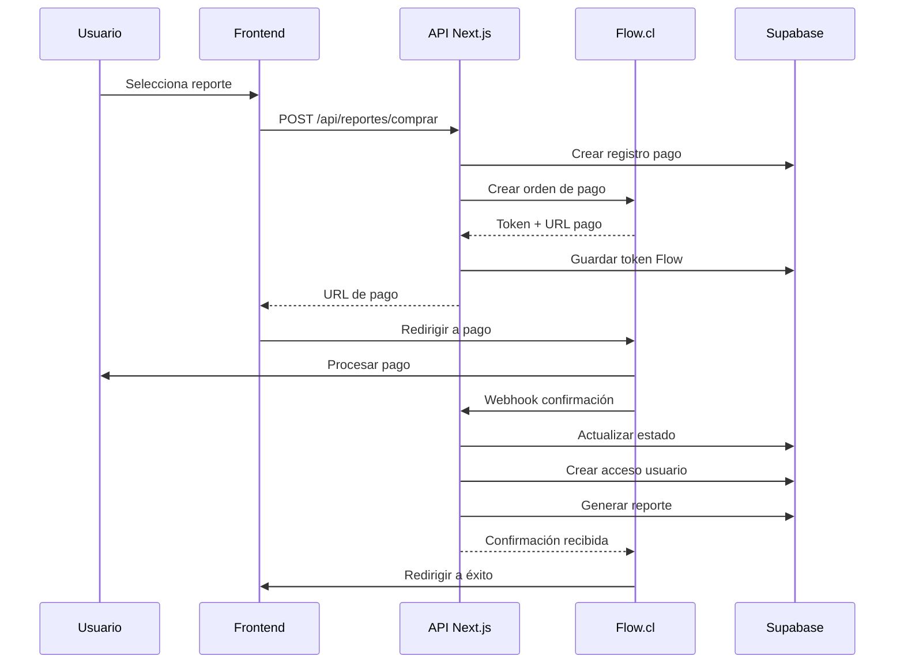

# 🔄 Integración Flow.cl - Documentación Completa

## 📁 Estructura de Documentación

Todos los documentos relacionados con la integración Flow.cl están organizados en esta carpeta:

```
docs/integracion-flow/
├── README.md                           # Este archivo - Guía principal
├── INTEGRACION-FLOW-COMPLETA.md       # Documentación técnica completa
├── esquema-completo-bd-corregido.sql  # Schema SQL corregido
├── .env.flow.example                  # Variables de entorno Flow.cl
├── demo-api-compra-completo.md        # Demo de API de compra
├── demo-compra-reporte.md             # Demo de compra de reportes
├── verificar-compra-simulada.sql      # Scripts de verificación
└── verificar-compra-simulada-corregido.sql
```

## 🚀 Guía de Inicio Rápido

### 1. **Configurar Variables de Entorno**

```bash
# Copiar archivo de ejemplo
cp docs/integracion-flow/.env.flow.example .env.local

# Editar con tus credenciales Flow.cl
nano .env.local
```

**Variables principales:**
```bash
FLOW_API_KEY=tu_api_key_aqui
FLOW_SECRET_KEY=tu_secret_key_aqui
FLOW_SANDBOX_MODE=true
FLOW_URL_RETURN=http://localhost:3000/pago/exito
FLOW_URL_CONFIRMATION=http://localhost:3000/api/flow/webhook
```

### 2. **Ejecutar Schema de Base de Datos**

```sql
-- En Supabase SQL Editor
-- Ejecutar: docs/integracion-flow/esquema-completo-bd-corregido.sql
```

### 3. **Configurar Webhooks en Flow.cl**

Ver sección [Configuración de Webhooks](#-configuración-de-webhooks) más abajo.

## 🔧 Configuración de Webhooks

### **¿Qué son los Webhooks?**

Los webhooks son URLs que Flow.cl llama automáticamente cuando ocurre un evento (como un pago confirmado). Son **esenciales** para:

- ✅ Confirmar pagos automáticamente
- ✅ Actualizar el estado en tu base de datos
- ✅ Generar reportes después del pago
- ✅ Enviar notificaciones al usuario

### **Configuración en Panel Flow.cl**

#### **Paso 1: Acceder al Panel**
1. Ir a [https://www.flow.cl](https://www.flow.cl)
2. Iniciar sesión en tu cuenta
3. Ir a **Panel de administración**

#### **Paso 2: Configurar API**
1. Ir a **Configuración > API**
2. Copiar tu **API Key** y **Secret Key**
3. Pegar en tu archivo `.env.local`

#### **Paso 3: Configurar Webhooks**
1. Ir a **Configuración > Webhooks**
2. Hacer clic en **"Agregar Webhook"**
3. Configurar:

**Para Desarrollo:**
```
URL: http://localhost:3000/api/flow/webhook
Eventos: payment.confirmed, payment.rejected
Método: POST
Activo: ✅
```

**Para Producción:**
```
URL: https://tu-dominio.com/api/flow/webhook
Eventos: payment.confirmed, payment.rejected
Método: POST
Activo: ✅
```

#### **Paso 4: Configurar URLs de Retorno**
1. Ir a **Configuración > URLs de Retorno**
2. Configurar:

```
URL de Éxito: http://localhost:3000/pago/exito
URL de Error: http://localhost:3000/pago/error
URL de Confirmación: http://localhost:3000/api/flow/webhook
```

### **Eventos de Webhook Importantes**

| Evento | Descripción | Acción en tu Sistema |
|--------|-------------|----------------------|
| `payment.confirmed` | Pago exitoso | Crear acceso + generar reporte |
| `payment.rejected` | Pago rechazado | Marcar pago como fallido |
| `payment.pending` | Pago pendiente | Mantener estado pendiente |
| `payment.cancelled` | Pago cancelado | Marcar como cancelado |

## 🏗️ Arquitectura del Sistema

### **Flujo de Pago Completo**



### **Estructura de Base de Datos**

| Tabla | Propósito |
|-------|----------|
| `corredores` | Información de corredores |
| `productos` | Catálogo de productos/reportes |
| `pagos` | Transacciones y pagos |
| `accesos_usuarios` | Permisos de acceso (1 año) |
| `reportes_individuales` | Reportes generados |
| `transacciones_flow` | Auditoría Flow.cl |
| `configuracion_flow` | Config API Flow.cl |
| `logs_sistema` | Auditoría del sistema |

## 🧪 Testing y Desarrollo

### **1. Modo Sandbox**

```bash
# En .env.local
FLOW_SANDBOX_MODE=true
FLOW_API_KEY=tu_sandbox_api_key
FLOW_SECRET_KEY=tu_sandbox_secret_key
```

### **2. Tarjetas de Prueba**

**VISA (Aprobada):**
```
Número: 4051885600446623
CVV: 123
Fecha: 12/25
```

**Mastercard (Rechazada):**
```
Número: 5186059559590568
CVV: 123
Fecha: 12/25
```

### **3. Probar Webhooks Localmente**

#### **Opción A: ngrok (Recomendado)**
```bash
# Instalar ngrok
brew install ngrok

# Exponer puerto local
ngrok http 3000

# Usar URL ngrok en configuración Flow.cl
# Ejemplo: https://abc123.ngrok.io/api/flow/webhook
```

#### **Opción B: Webhook Testing**
```bash
# Usar herramientas como webhook.site para testing
# 1. Ir a https://webhook.site
# 2. Copiar URL única
# 3. Configurar en Flow.cl temporalmente
# 4. Ver requests en tiempo real
```

## 📊 Monitoreo y Logs

### **1. Verificar Pagos**

```sql
-- Ver pagos recientes
SELECT 
    orden_comercio,
    estado,
    amount,
    metodo_pago,
    flow_status,
    fecha_creacion
FROM pagos 
ORDER BY fecha_creacion DESC 
LIMIT 10;
```

### **2. Verificar Webhooks**

```sql
-- Ver transacciones Flow.cl
SELECT 
    flow_token,
    flow_status,
    flow_amount,
    flow_payment_date,
    fecha_creacion
FROM transacciones_flow 
ORDER BY fecha_creacion DESC;
```

### **3. Logs del Sistema**

```sql
-- Ver logs de compras
SELECT 
    user_id,
    accion,
    datos_nuevos,
    fecha_creacion
FROM logs_sistema 
WHERE accion LIKE '%compra%'
ORDER BY fecha_creacion DESC;
```

## 🚨 Solución de Problemas

### **Error: "precio_bruto is a generated column"**

**Problema:** La tabla `productos` tiene `precio_bruto` como columna generada.

**Solución:** Usar el schema corregido:
```bash
# Ejecutar en Supabase
docs/integracion-flow/esquema-completo-bd-corregido.sql
```

### **Webhooks no funcionan**

**Verificar:**
1. ✅ URL webhook configurada en Flow.cl
2. ✅ Servidor corriendo en puerto correcto
3. ✅ URL accesible desde internet (usar ngrok)
4. ✅ Endpoint `/api/flow/webhook` implementado

### **Pagos no se confirman**

**Verificar:**
1. ✅ Credenciales Flow.cl correctas
2. ✅ Modo sandbox/producción correcto
3. ✅ Webhook recibiendo llamadas
4. ✅ Base de datos actualizada

## 🔐 Seguridad

### **Variables de Entorno**
```bash
# NUNCA commitear credenciales reales
# Usar .env.local (ignorado por git)
# Rotar keys periódicamente
```

### **Validación de Webhooks**
```javascript
// Validar firma de webhook
const signature = request.headers['x-flow-signature'];
const isValid = validateFlowSignature(body, signature, secretKey);
```

### **HTTPS en Producción**
```bash
# Obligatorio para webhooks en producción
FLOW_URL_CONFIRMATION=https://tu-dominio.com/api/flow/webhook
```

## 📚 Documentación Adicional

- **[Documentación Técnica Completa](./INTEGRACION-FLOW-COMPLETA.md)** - Código completo y ejemplos
- **[Demo API Compra](./demo-api-compra-completo.md)** - Ejemplos de uso de API
- **[Schema SQL](./esquema-completo-bd-corregido.sql)** - Base de datos completa
- **[Variables de Entorno](./env.flow.example)** - Configuración completa

## 🆘 Soporte

### **Documentación Flow.cl**
- [API Documentation](https://www.flow.cl/docs/api.html)
- [Sandbox Testing](https://sandbox.flow.cl)
- [Webhook Configuration](https://www.flow.cl/docs/api.html#webhook)

### **Contacto Técnico Flow.cl**
- Email: soporte@flow.cl
- Teléfono: +56 2 2757 4000
- Chat: Panel de administración Flow.cl

---

## ✅ Checklist de Implementación

- [ ] **Configuración Inicial**
  - [ ] Cuenta Flow.cl creada
  - [ ] Credenciales API obtenidas
  - [ ] Variables de entorno configuradas

- [ ] **Base de Datos**
  - [ ] Schema SQL ejecutado
  - [ ] Tablas creadas correctamente
  - [ ] Datos de prueba insertados

- [ ] **Webhooks**
  - [ ] URL webhook configurada en Flow.cl
  - [ ] Endpoint `/api/flow/webhook` implementado
  - [ ] ngrok configurado para desarrollo

- [ ] **Testing**
  - [ ] Modo sandbox activado
  - [ ] Pago de prueba exitoso
  - [ ] Webhook recibido correctamente
  - [ ] Reporte generado automáticamente

- [ ] **Producción**
  - [ ] Credenciales de producción configuradas
  - [ ] HTTPS configurado
  - [ ] URLs de producción en Flow.cl
  - [ ] Monitoreo y alertas configuradas

---

**🎉 ¡Sistema Flow.cl listo para usar!**